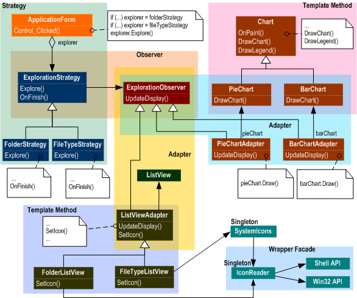

  
  

When talking about design patterns we have to understand what design patterns mean. Design patterns are foundations which could lead 
to finishing a project, for working with a group of co-workers understanding the project design could mean efficiently finishing before
the deadline. Designing a pattern to best fit the situation is part of thinking beyond, which will make coding in a group and individually
more easier and more understandable.

  
  
My professor at the University of Hawaii at Manoa once told me that designing a pattern and solutions for the problem is 70% of the work
and that coding is 30%. By having a good understanding of the problem, it would be common knowledge when coding the solution with a good
framework to the design. 

Getting to understand that design patterns are templates, and the code that is underlining the templates are the tiny details about the 
project in hand. It't compared to a paper, having an outline is like having the design pattern, while writing the whole paper is like the
code. If done step by step we are able to complete a program in which excels in design and fluidity. 

