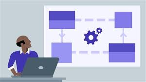

  
  

When talking about design patterns we have to understand what design patterns mean. Design patterns are foundations which could lead 
to finishing a project, for working with a group of co-workers understanding the project design could mean efficiently finishing before
the deadline.

  
