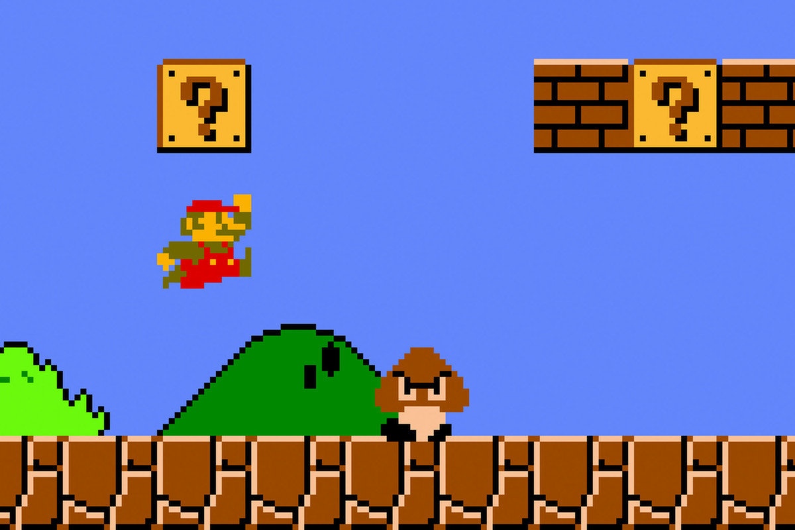

Ever since I was young I would always play some sort of game, the way that the game moves, function, and have a story fascinated me. The design of the game made want more, I played a lot of games and the reason I keep playing is because Its something new either the mechanic or CPU. I crave more and I want to learn more, programming at first was boring, but the more I program the more everything made sense, and slowly I became addicted to building programs, either shown as models or data. 

